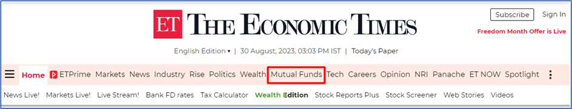
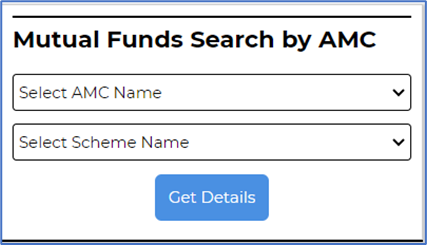
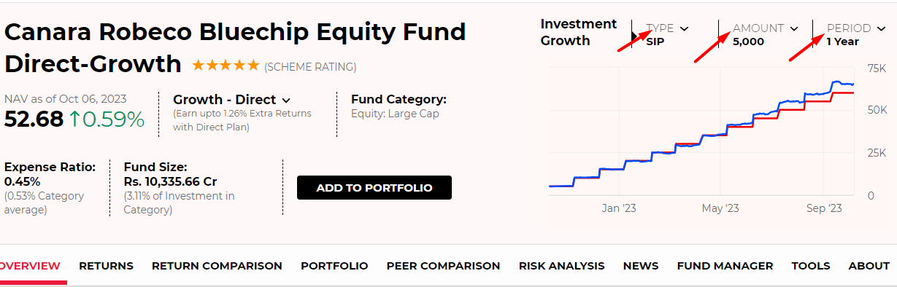
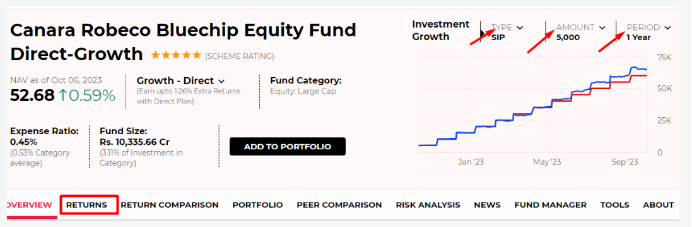
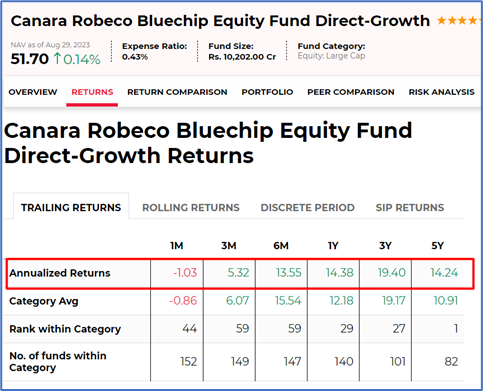

### Project Question

1. Use the appropriate TestNG annotation for the cases and generate the TestNG reports. (i.e., @BeforeTest, @AfterTest, @BeforeMethod, @AfterMethod, etc.,)

Note: If any ad page display wait 10 seconds to load the page.

Navigate to: https://economictimes.indiatimes.com/et-now/results

1. Open your web browser and visit the Economic Times website by going to https://economictimes.indiatimes.com/et-now/results/.

2. In the website's header section, locate and click on "Mutual Funds." and wait for 10 second to load the page.

3. Scroll down on the redirected page, on the right side you will find the "Mutual Fund Search by AMC" section.

4. Click on the "Select AMC Name" dropdown and choose "Canara Robeco."

5. Below that, click on the "Select scheme name" dropdown and select "Canara Robeco Bluechip Equity Direct-G."

6. Click the "Get Details" button.

7. This action will open a new tab with information about the Canara Robeco Bluechip Equity Fund Direct-Growth.

8. Scroll down, select the dropdowns for investment growth, select the type dropdown and choose "SIP" and choose the amount as "1,000," and the period as "3 years."

9. If you click on the "**Returns**" option, you will be directed to the “Canara Robeco Bluechip Equity Fund Direct-Growth “Returns section.

10. In the "Trailing Returns" section capture the screenshot, retrieve and display the details from the first table row, which provides information about annualized returns, in the terminal.

**Note: To see your report folder, click on the surefire-output folder.**

Note :

The project will not be submitted if "Submit Project" is not done atleast once
