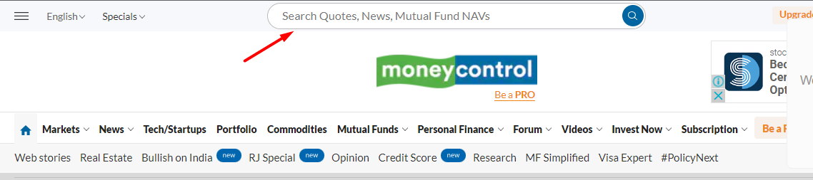
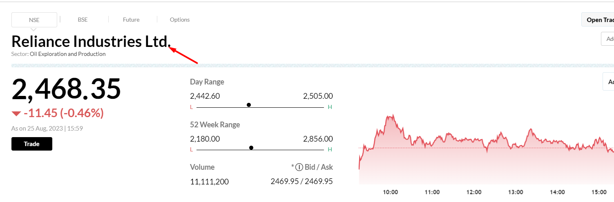
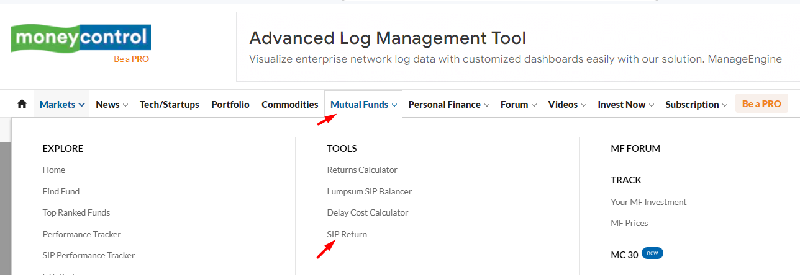
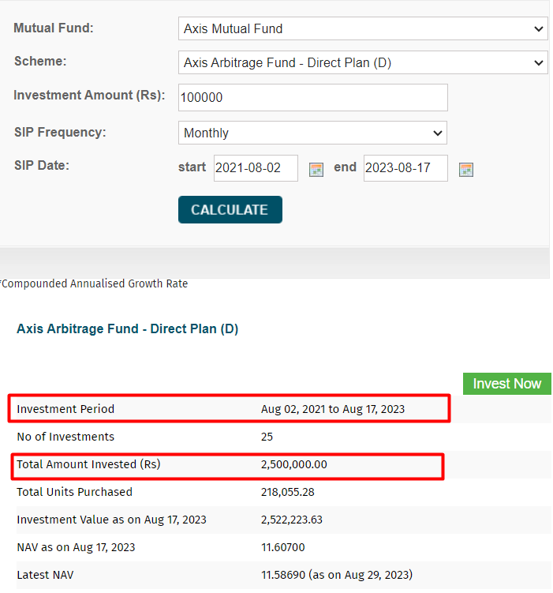

### Project Question

(Q2) Use the appropriate TestNG annotation for the cases and generate the TestNG reports. (i.e., @BeforeTest, @AfterTest, @BeforeMethod, @AfterMethod, etc.,)

If any pop-ups occurs, handle it by using Webdriver wait or reload the page.

Navigate to: [https://www.moneycontrol.com](https://www.moneycontrol.com/)

Test Steps:

1.Open your web browser and go to the Money control website.

2.On the top of the homepage, locate and click on the search box.

3.In the search-box , enter the data as "Reliance Industries."

4.Click on the primary suggestion in the displayed list, which will lead you to the chosen option .

5.Scroll down further and verify that the page contains the specific term "Reliance Industries Ltd."

6.At the top navigation bar of the same page, click on the "Mutual Funds" dropdown and select the "SIP Return" option.

7.This action will redirect you to the SIP Calculator page. Here, choose the mutual fund named "**Axis Mutual Fund**" within the SIP calculator.

8.Choose for the mutual fund scheme as "**Axis Arbitrage Fund - Regular Plan (D**)."

9.Enter the investment amount as "**100,000"** Indian Rupees.

10.Set the SIP frequency to "**Monthly**."

11.Pick the start date as "**2021-08-02,**" and choose the end date as "**2023-08-17**" from the calendar.

12.Click on the "Calculate" button to proceed with the calculations.

13.Retrieve and display the investment period ("August 02, 2021 to August 17, 2023") from the first row, second data in the terminal.

Similarly, output the result of the "total amount invested" from the third row, second data in the terminal.

**Note: To see your report folder, click on the surefire-output folder.**
