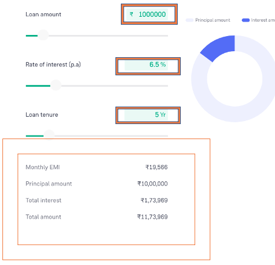

### Project Question

**Instructions:**

1. When you open the workspace, click "ACCEPT" in the lower-right corner of the REDHAT notification to enable import package suggestions while working on Selenium scripts.

2. Ensure that you do not make any changes to the existing main class file.

3. Common Maven Commands for Selenium:

   - To change to a specific directory: cd /path of your maven project

   - To run all test cases: mvn clean test

   - To change to a parent directory: cd ..

4. To view the running scripts,

   - Click on port 8081, and you'll be directed to a new window. In the URL bar of this new window, replace "8081" with "4444" to access the Selenium Grid.

   - Perform the same procedure again, but replace "8081" with "7900" for VNC server page

   - To view the execution, click on the "connect" button on the VNC server page and enter the password "secret".

5. If you need to terminate an active session in the Selenium Grid, you can click on the "reset grid" button located next to the "reload ide" button.

6. To execute your test scripts, click Run Test Case.

7. To submit your code, click "Submit Project" and to end the Test by clicking "Submit Test", where you find dialog box enter the text **"END"**.

---

### **Question 01**

Use the appropriate TestNG annotation for the cases and generate the TestNG reports. (i.e., @BeforeTest, @AfterTest, @BeforeMethod, @AfterMethod, etc.,)

1.  Open your web browser and visit the Groww website by going to [https://groww.in/](https://groww.in/).
2.  In the website's footer section, locate and click on "Quick Links."
3.  From the quick links, select "Calculators."
4.  You'll be directed to the calculator page.
5.  Scroll down on the calculator page and choose the "home loan EMI" calculator.
6.  You'll be taken to the home loan calculator page. Enter a new loan amount of "23,00,000" in the loan amount input field.
7.  Input the value from default interest rate from 6.5% to 8%.
8.  Input the loan tenure to 25 years.
9.  Retrieve and display the values from the results table on the terminal with the following labels:

    - Monthly EMI:
    - Principal Amount:
    - Total Interest:
    - Total Amount:

**Note: To see your report folder, click on the surefire-output folder.**
